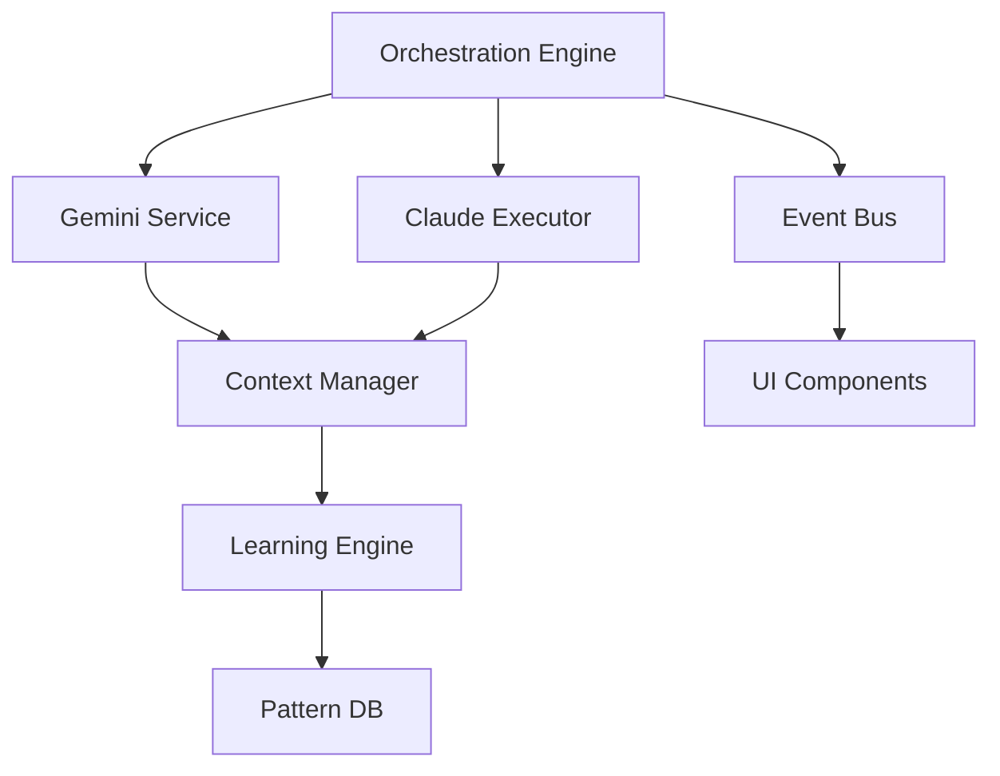

# Dual-AI Orchestration TUI Implementation Workflow

## System Architecture Overview

**Core Concept**: Gemini (Orchestrator) → Claude Code with SCF (Executor) → Feedback Loop
- **Gemini**: Analyzes objectives, proposes `/sc:` commands, interprets execution results
- **Claude Code**: Terminal app with SuperClaude Framework for enhanced command execution
- **TUI**: Manages orchestration, displays progress, captures learning

## Phase 1: Foundation (Week 1-2)
**Goal**: Establish event-driven architecture and core data models for dual-AI orchestration

### 1.1 Event System & Communication Layer
**Owner**: Backend Architect | **Duration**: 3 days

#### Implementation Tasks:
```python
# Create event bus for dual-AI communication
imthedev/infrastructure/events/
├── orchestration_bus.py      # Central event dispatcher
├── command_events.py          # SC command lifecycle events
├── gemini_events.py          # Orchestrator events
├── claude_events.py          # Executor events
└── feedback_events.py        # Analysis & learning events
```

**Key Events**:
- `ObjectiveSubmitted` → User provides goal
- `CommandProposed` → Gemini suggests SC command
- `CommandApproved` → User approves execution
- `ExecutionStarted` → Claude Code begins
- `OutputStreaming` → Real-time execution output
- `ExecutionComplete` → Command finished
- `ResultAnalyzed` → Gemini interprets output
- `NextStepProposed` → Continuation strategy

#### Acceptance Criteria:
- [ ] Async event bus handles 1000+ events/sec
- [ ] Events preserve full context chain
- [ ] Cross-component communication < 10ms
- [ ] Event replay capability for debugging

### 1.2 Data Models for Orchestration
**Owner**: Domain Expert | **Duration**: 2 days

```python
# imthedev/core/orchestration/models.py

@dataclass
class OrchestrationObjective:
    """High-level goal from user"""
    id: UUID
    description: str
    success_criteria: list[str]
    created_at: datetime
    status: ObjectiveStatus
    
@dataclass  
class OrchestrationStep:
    """Single step in orchestration"""
    id: UUID
    objective_id: UUID
    command: str  # Full /sc: command
    reasoning: str  # Gemini's explanation
    status: StepStatus
    result: Optional[ExecutionResult]
    
@dataclass
class ExecutionResult:
    """Output from Claude Code"""
    stdout: str
    stderr: str
    files_created: list[Path]
    files_modified: list[Path]
    tests_run: Optional[TestResults]
    
@dataclass
class GeminiAnalysis:
    """Gemini's interpretation of results"""
    success: bool
    understanding: str
    missing_elements: list[str]
    next_action: str
    confidence: float
```

### 1.3 Gemini Integration Service
**Owner**: AI Integration Lead | **Duration**: 3 days

```python
# imthedev/core/services/gemini_orchestrator.py

class GeminiOrchestrator:
    """Manages Gemini's orchestration logic"""
    
    async def analyze_objective(self, objective: str) -> OrchestrationPlan:
        """Break down objective into SC commands"""
        
    async def propose_command(self, context: OrchestrationContext) -> CommandProposal:
        """Generate next SC command based on context"""
        
    async def analyze_execution_result(self, result: ExecutionResult) -> GeminiAnalysis:
        """Interpret Claude Code output"""
        
    async def determine_next_step(self, analysis: GeminiAnalysis) -> Optional[CommandProposal]:
        """Decide if more steps needed"""
```

### 1.4 Claude Code Executor Service  
**Owner**: Integration Engineer | **Duration**: 2 days

```python
# imthedev/core/services/claude_executor.py

class ClaudeCodeExecutor:
    """Manages Claude Code terminal execution"""
    
    async def execute_command(self, command: str) -> AsyncIterator[str]:
        """Stream execution of SC command"""
        # Launches subprocess with claude-code CLI
        # Captures real-time output
        # Handles SCF-enhanced responses
        
    async def validate_command(self, command: str) -> bool:
        """Check if SC command is valid"""
        
    async def extract_metadata(self, output: str) -> ExecutionMetadata:
        """Parse SCF-enhanced output for metadata"""
```

## Phase 2: Core UI Components (Week 3-4)
**Goal**: Build Textual TUI components for dual-AI interaction

### 2.1 Orchestration Console Widget
**Owner**: Frontend Lead | **Duration**: 3 days

```python
# imthedev/ui/tui/components/orchestration_console.py

class OrchestrationConsole(Widget):
    """Main orchestration interface"""
    
    def compose(self) -> ComposeResult:
        yield ObjectiveInput()  # User enters goals
        yield ExecutionAnalysis()  # Shows Gemini's analysis
        yield CommandProposal()  # Displays proposed SC command
        yield ApprovalControls()  # Approve/Modify/Skip buttons
        
    @on(ObjectiveSubmitted)
    async def handle_objective(self, event: ObjectiveSubmitted):
        """Send to Gemini for analysis"""
        
    @on(CommandProposed)  
    async def display_proposal(self, event: CommandProposed):
        """Show SC command with reasoning"""
```

### 2.2 Execution Monitor Widget
**Owner**: UI Developer | **Duration**: 2 days

```python
# imthedev/ui/tui/components/execution_monitor.py

class ExecutionMonitor(Widget):
    """Real-time Claude Code execution display"""
    
    def compose(self) -> ComposeResult:
        yield StatusIndicator()  # Running/Complete/Failed
        yield CommandDisplay()   # Current SC command
        yield OutputConsole()    # Streaming stdout/stderr
        yield MetricsPanel()     # Time, files, tests
        
    @on(ExecutionStarted)
    async def start_monitoring(self, event: ExecutionStarted):
        """Begin streaming output"""
        
    @on(OutputChunk)
    async def append_output(self, event: OutputChunk):
        """Stream Claude Code output in real-time"""
```

### 2.3 Feedback Visualizer
**Owner**: UI Developer | **Duration**: 2 days

```python
# imthedev/ui/tui/components/feedback_visualizer.py

class FeedbackVisualizer(Widget):
    """Shows orchestration flow and feedback loop"""
    
    def render_flow(self) -> str:
        """
        Intent → Gemini → Approve → Claude → Analyze → Next
           ↑                                      ↓
           └──────────────────────────────────────┘
        """
        
    def update_current_stage(self, stage: OrchestrationStage):
        """Highlight current position in flow"""
```

### 2.4 Command Inspector
**Owner**: Frontend Developer | **Duration**: 3 days

```python
# imthedev/ui/tui/components/command_inspector.py

class CommandInspector(Modal):
    """Interactive SC command builder with context"""
    
    def compose(self) -> ComposeResult:
        yield ContextPanel()      # Previous results context
        yield CommandBuilder()    # SC command construction
        yield FlagSelector()      # SCF flags (--think, --seq, etc)
        yield PersonaSelector()   # Auto-suggested personas
        yield PreviewPanel()      # Command preview
```

### 2.5 Main Application Shell
**Owner**: Lead Developer | **Duration**: 2 days

```python
# imthedev/ui/tui/app.py

class ImTheDevApp(App):
    """Main TUI application with dual-AI orchestration"""
    
    BINDINGS = [
        ("ctrl+o", "toggle_orchestration", "Orchestration Mode"),
        ("ctrl+e", "toggle_execution", "Execution View"),
        ("a", "approve_command", "Approve"),
        ("m", "modify_command", "Modify"),
    ]
    
    def compose(self) -> ComposeResult:
        with TabbedContent():
            with TabPane("Orchestrate"):
                yield OrchestrationConsole()
                yield ExecutionMonitor()
            with TabPane("Commands"):
                yield CommandDashboard()
            with TabPane("Context"):
                yield ProjectContext()
```

## Phase 3: Intelligence Layer (Week 5-6)
**Goal**: Implement orchestration logic and feedback loop

### 3.1 Orchestration Engine
**Owner**: AI Architect | **Duration**: 4 days

```python
# imthedev/core/orchestration/engine.py

class OrchestrationEngine:
    """Core orchestration logic coordinator"""
    
    def __init__(self):
        self.gemini = GeminiOrchestrator()
        self.claude = ClaudeCodeExecutor()
        self.state = OrchestrationState()
        
    async def orchestrate_objective(self, objective: str) -> None:
        """Main orchestration loop"""
        # 1. Gemini analyzes objective
        plan = await self.gemini.analyze_objective(objective)
        
        # 2. Execute steps iteratively
        for step in plan.steps:
            # Propose command
            proposal = await self.gemini.propose_command(self.state.context)
            await self.emit(CommandProposed(proposal))
            
            # Wait for approval
            approval = await self.wait_for_approval()
            if not approval:
                continue
                
            # Execute with Claude Code
            async for output in self.claude.execute_command(proposal.command):
                await self.emit(OutputStreaming(output))
                
            # Analyze results
            result = await self.claude.get_execution_result()
            analysis = await self.gemini.analyze_execution_result(result)
            
            # Determine next step
            if not analysis.success:
                recovery = await self.gemini.propose_recovery(analysis)
                # Continue with recovery...
```

### 3.2 Context Management System
**Owner**: Backend Engineer | **Duration**: 3 days

```python
# imthedev/core/orchestration/context_manager.py

class OrchestrationContextManager:
    """Maintains context across orchestration cycles"""
    
    def __init__(self):
        self.command_history: list[ExecutedCommand] = []
        self.file_changes: dict[Path, list[Change]] = {}
        self.test_results: list[TestResult] = []
        self.learned_patterns: list[Pattern] = []
        
    def build_context_for_gemini(self) -> str:
        """Create context prompt for Gemini"""
        return f"""
        Previous Commands:
        {self.format_command_history()}
        
        Files Created/Modified:
        {self.format_file_changes()}
        
        Test Results:
        {self.format_test_results()}
        
        Known Patterns:
        {self.format_patterns()}
        """
        
    def update_from_execution(self, result: ExecutionResult):
        """Update context with latest execution"""
```

### 3.3 SCF Command Generation
**Owner**: Integration Specialist | **Duration**: 3 days

```python
# imthedev/core/orchestration/scf_generator.py

class SCFCommandGenerator:
    """Generates optimized SuperClaude commands"""
    
    def generate_command(self, 
                        intent: str,
                        context: OrchestrationContext) -> str:
        """Build SC command with appropriate flags"""
        
        # Analyze intent for command type
        command_type = self.detect_command_type(intent)
        
        # Select appropriate personas
        personas = self.select_personas(intent, context)
        
        # Determine thinking depth
        thinking_flag = self.determine_thinking_depth(context.complexity)
        
        # Add MCP servers if needed
        mcp_flags = self.select_mcp_servers(intent)
        
        # Build final command
        return f"/sc:{command_type} {intent} {personas} {thinking_flag} {mcp_flags}"
        
    def validate_command_syntax(self, command: str) -> bool:
        """Ensure SC command is valid"""
```

### 3.4 Learning Engine
**Owner**: ML Engineer | **Duration**: 4 days

```python
# imthedev/core/orchestration/learning_engine.py

class OrchestrationLearningEngine:
    """Captures and applies patterns from orchestration"""
    
    def __init__(self):
        self.pattern_db = PatternDatabase()
        self.success_metrics = SuccessMetrics()
        
    async def learn_from_execution(self, 
                                  objective: Objective,
                                  steps: list[OrchestrationStep],
                                  outcome: Outcome):
        """Extract patterns from successful orchestrations"""
        
        if outcome.successful:
            pattern = Pattern(
                trigger=objective.type,
                command_sequence=[s.command for s in steps],
                success_rate=self.calculate_success_rate(),
                context_requirements=self.extract_context_requirements(steps)
            )
            await self.pattern_db.save(pattern)
            
    async def suggest_pattern(self, objective: str) -> Optional[Pattern]:
        """Find matching pattern for objective"""
        return await self.pattern_db.find_best_match(objective)
```

### 3.5 Feedback Loop Controller
**Owner**: System Architect | **Duration**: 3 days

```python
# imthedev/core/orchestration/feedback_controller.py

class FeedbackLoopController:
    """Manages the continuous feedback loop"""
    
    async def process_feedback_cycle(self, execution_result: ExecutionResult):
        """Complete feedback loop cycle"""
        
        # 1. Parse Claude Code output
        parsed = self.parse_scf_output(execution_result.stdout)
        
        # 2. Extract key information
        metrics = self.extract_metrics(parsed)
        errors = self.extract_errors(parsed)
        suggestions = self.extract_suggestions(parsed)
        
        # 3. Send to Gemini for analysis
        analysis = await self.gemini.analyze_feedback(
            metrics=metrics,
            errors=errors,
            suggestions=suggestions,
            context=self.context
        )
        
        # 4. Determine action
        if analysis.requires_correction:
            return await self.generate_correction_command(analysis)
        elif analysis.can_continue:
            return await self.generate_next_command(analysis)
        else:
            return None  # Objective complete
```

## Phase 4: Advanced Features (Week 7-8)
**Goal**: Enhance with learning, optimization, and advanced capabilities

### 4.1 Pattern Recognition System
**Owner**: ML Engineer | **Duration**: 3 days

```python
# imthedev/core/orchestration/pattern_recognition.py

class PatternRecognitionSystem:
    """Identifies and applies successful orchestration patterns"""
    
    async def detect_patterns(self, history: list[OrchestrationSession]):
        """Find recurring successful patterns"""
        patterns = {
            "auth_flow": {
                "trigger": "authentication|login|auth",
                "sequence": [
                    "/sc:analyze --focus security",
                    "/sc:implement auth --backend",
                    "/sc:test auth",
                    "/sc:implement LoginUI --frontend"
                ],
                "success_rate": 0.95
            },
            "performance_optimization": {
                "trigger": "optimize|performance|slow",
                "sequence": [
                    "/sc:analyze --focus performance",
                    "/sc:profile",
                    "/sc:improve --performance"
                ]
            }
        }
        
    async def auto_suggest_next_command(self, context: Context) -> CommandSuggestion:
        """Suggest next command based on patterns"""
```

### 4.2 Multi-Objective Orchestration
**Owner**: Senior Architect | **Duration**: 3 days

```python
# imthedev/core/orchestration/multi_objective.py

class MultiObjectiveOrchestrator:
    """Handle complex multi-goal orchestrations"""
    
    async def decompose_complex_objective(self, objective: str) -> list[SubObjective]:
        """Break down complex goals into sub-objectives"""
        
    async def orchestrate_parallel_objectives(self, objectives: list[Objective]):
        """Run multiple objectives simultaneously when possible"""
        
    async def manage_dependencies(self, objectives: list[Objective]):
        """Handle inter-objective dependencies"""
```

### 4.3 Advanced UI Components
**Owner**: Senior Frontend | **Duration**: 4 days

```python
# imthedev/ui/tui/components/advanced/

class OrchestrationTimeline(Widget):
    """Visual timeline of orchestration steps"""
    
class LearningDashboard(Widget):
    """Display learned patterns and success metrics"""
    
class CommandPalette(Modal):
    """Context-aware command suggestions"""
    
class ObjectiveBuilder(Widget):
    """Guided objective creation with templates"""
```

### 4.4 Performance Optimization
**Owner**: Performance Engineer | **Duration**: 2 days

```python
# imthedev/core/optimization/

class OrchestrationOptimizer:
    """Optimize orchestration performance"""
    
    def optimize_command_sequence(self, commands: list[str]) -> list[str]:
        """Reorder commands for efficiency"""
        
    def cache_gemini_responses(self):
        """Cache common analysis patterns"""
        
    def parallelize_executions(self):
        """Run independent commands in parallel"""
```

## Integration Testing Strategy

### Test Levels

#### 1. Unit Tests
```python
# tests/unit/orchestration/
test_gemini_orchestrator.py    # Gemini service tests
test_claude_executor.py         # Claude Code execution tests
test_feedback_controller.py     # Feedback loop tests
test_pattern_recognition.py     # Pattern system tests
```

#### 2. Integration Tests
```python
# tests/integration/
test_dual_ai_communication.py   # Gemini ↔ Claude Code
test_event_flow.py              # End-to-end event flow
test_orchestration_loop.py      # Complete orchestration cycles
test_ui_orchestration.py        # UI ↔ Orchestration engine
```

#### 3. E2E Orchestration Tests
```python
# tests/e2e/orchestration_scenarios/
test_simple_feature.py          # Single command orchestration
test_complex_objective.py       # Multi-step orchestration
test_error_recovery.py          # Failure handling
test_learning_application.py    # Pattern learning and reuse
```

### Test Scenarios

```python
@pytest.mark.asyncio
async def test_complete_orchestration_cycle():
    """Test full orchestration from objective to completion"""
    
    # 1. Submit objective
    objective = "Add user authentication"
    
    # 2. Verify Gemini proposes correct command
    proposal = await orchestrator.get_proposal(objective)
    assert "/sc:analyze" in proposal.command
    
    # 3. Approve and execute
    result = await executor.execute(proposal.command)
    
    # 4. Verify feedback loop
    analysis = await orchestrator.analyze_result(result)
    assert analysis.next_step is not None
    
    # 5. Continue until complete
    while not orchestrator.is_complete():
        next_proposal = await orchestrator.get_next_proposal()
        # ...continue cycle
```

## Deployment & Rollout Plan

### Pre-Deployment Checklist
- [ ] Claude Code CLI installed and configured
- [ ] SuperClaude Framework (SCF) properly installed in Claude Code
- [ ] Gemini API credentials configured
- [ ] All unit tests passing (>95% coverage)
- [ ] Integration tests validated
- [ ] Performance benchmarks met

### Rollout Phases

#### Alpha Release (Week 9)
- Internal testing with development team
- Basic orchestration flow validation
- Manual pattern collection

#### Beta Release (Week 10)
- Limited user group (10-20 users)
- Feedback collection on orchestration accuracy
- Pattern learning refinement

#### Production Release (Week 11)
- Full release with monitoring
- Performance optimization based on usage
- Continuous learning enabled

## Risk Assessment & Mitigation

### Technical Risks

| Risk | Impact | Probability | Mitigation |
|------|--------|-------------|------------|
| Claude Code API changes | High | Medium | Version pinning, compatibility layer |
| Gemini hallucination in commands | High | Medium | Command validation, sandboxing |
| Event loop bottlenecks | Medium | Low | Async optimization, queue management |
| Context overflow | Medium | Medium | Intelligent context pruning |
| SCF command failures | Medium | High | Comprehensive error handling |

### Mitigation Strategies

```python
# imthedev/core/safety/command_validator.py

class CommandSafetyValidator:
    """Validate SC commands before execution"""
    
    DANGEROUS_PATTERNS = [
        r"rm -rf",
        r"sudo.*",
        r"--force.*--no-confirm"
    ]
    
    def validate_command(self, command: str) -> ValidationResult:
        """Ensure command is safe to execute"""
        
    def sandbox_execution(self, command: str):
        """Run in isolated environment first"""
```

## Critical Dependencies

### External Dependencies
- **Claude Code CLI**: v1.0+ with SCF installed
- **Gemini API**: gemini-2.0-pro with function calling
- **Textual**: v5.0.1 for TUI framework
- **Python**: 3.11+ with async support

### Internal Dependencies


## Performance Requirements

### Response Time Targets
- Gemini command proposal: < 2s
- Claude Code execution start: < 500ms
- UI interaction response: < 50ms
- Event propagation: < 10ms
- Pattern matching: < 100ms

### Scalability Targets
- Concurrent orchestrations: 10+
- Command history: 10,000+ entries
- Pattern database: 1,000+ patterns
- Context size: 32K tokens

## Acceptance Criteria

### Phase 1 Complete When:
- [ ] Event system handles 1000+ events/sec
- [ ] All data models implemented with validation
- [ ] Gemini can propose valid SC commands
- [ ] Claude Code executor streams output

### Phase 2 Complete When:
- [ ] All UI components render correctly
- [ ] User can approve/modify commands
- [ ] Execution output streams in real-time
- [ ] Keyboard shortcuts functional

### Phase 3 Complete When:
- [ ] Full orchestration loop executes
- [ ] Feedback loop analyzes results
- [ ] Context maintained across cycles
- [ ] Learning captures patterns

### Phase 4 Complete When:
- [ ] Pattern recognition functional
- [ ] Multi-objective support works
- [ ] Performance targets met
- [ ] Advanced UI features complete

## Implementation Priorities

### Must Have (MVP)
1. Basic orchestration loop
2. Command proposal and approval
3. Execution monitoring
4. Simple feedback analysis

### Should Have (v1.0)
1. Pattern learning
2. Context preservation
3. Advanced command builder
4. Performance optimization

### Nice to Have (v2.0)
1. Multi-objective orchestration
2. Parallel execution
3. Visual timeline
4. Export/import patterns

## Success Metrics

### Technical Metrics
- Orchestration success rate: >85%
- Command accuracy: >90%
- Pattern reuse rate: >40%
- Average cycles to complete: <5

### User Metrics
- Time to complete objective: -50% vs manual
- User intervention rate: <30%
- Pattern suggestion acceptance: >70%
- User satisfaction: >4.5/5

## Summary

This comprehensive workflow creates a dual-AI orchestration system where:

1. **Gemini acts as the intelligent orchestrator** - analyzing objectives, proposing SuperClaude commands, and interpreting results
2. **Claude Code with SCF acts as the powerful executor** - running enhanced commands with all SCF capabilities
3. **The TUI manages the orchestration dance** - coordinating between AIs, capturing user approval, and learning from patterns
4. **The feedback loop enables continuous improvement** - each execution informs the next step

The systematic implementation approach ensures:
- Clean separation between orchestrator (Gemini) and executor (Claude Code)
- Event-driven architecture for real-time responsiveness  
- Progressive enhancement from basic to advanced features
- Comprehensive testing at all levels
- Safe and controlled deployment

## Executive Summary

The dual-AI orchestration TUI implementation plan establishes a sophisticated system where **Gemini orchestrates** and **Claude Code (with SuperClaude Framework) executes**, creating an intelligent development workflow automation system.

### Key Architecture Decisions
- **Dual-AI Design**: Gemini as orchestrator, Claude Code as executor (not Gemini-only)
- **Event-Driven**: Async message passing between all components
- **Feedback Loop**: Continuous learning from execution results
- **SCF Integration**: Leverages SuperClaude Framework for enhanced command capabilities

### Implementation Timeline
- **Weeks 1-2**: Foundation (events, models, services)
- **Weeks 3-4**: Core UI (orchestration console, execution monitor)
- **Weeks 5-6**: Intelligence (orchestration engine, feedback loop)
- **Weeks 7-8**: Advanced (patterns, optimization)
- **Weeks 9-11**: Testing, deployment, rollout

### Critical Success Factors
1. Proper separation of orchestrator/executor responsibilities
2. Real-time streaming of Claude Code output
3. Intelligent context management between cycles
4. Pattern learning for improved suggestions
5. User control at every decision point

This workflow provides a complete roadmap for building the ambitious dual-AI orchestration system specified in TUI_DESIGN.md, with clear phases, deliverables, and success criteria.